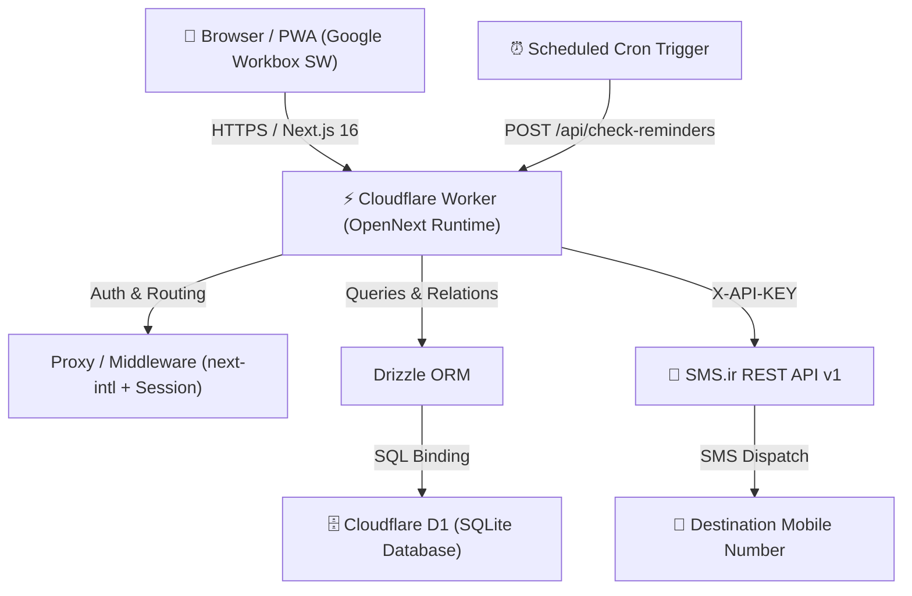

<div align="center">

  

  # Checkpoint (چک‌پوینت)
  
  **An edge-native, privacy-first personal goal tracker with automated SMS reminders and dual calendar support.**

  [](https://nextjs.org/)
  [](https://workers.cloudflare.com/)
  [](https://developers.cloudflare.com/d1/)
  [](https://developer.chrome.com/docs/workbox/)
  [](https://tailwindcss.com/)
  [](LICENSE)

  [Live Demo](https://checkpoint.josheqani-824.workers.dev) • [Features](#features) • [Quick Start](#quick-start-local-development) • [Cloudflare Deployment](#self-hosted-cloudflare-deployment) • [Architecture](#architecture)

</div>

---

## 📖 What is Checkpoint?

**Checkpoint** is an ultra-fast, edge-hosted personal productivity system designed to keep you accountable to your long-term and short-term goals. Unlike standard todo lists that get forgotten inside browser tabs, Checkpoint sends **timely, automated SMS notifications** directly to your phone whenever an upcoming checkpoint or goal deadline is due.

Built natively for **Cloudflare Workers** using **Next.js 16 (Turbopack)** and **OpenNext**, Checkpoint delivers sub-millisecond global cold starts with zero server maintenance, zero monthly hosting bills, and maximum personal privacy.

---

## ✨ Key Features

- **🎯 Milestone & Goal Management**: Create, edit, and organize personal and professional goals with descriptions and target completion deadlines.
- **📱 Automated SMS Reminders**:
  - Direct integration with the **SMS.ir REST API v1**.
  - One-time milestone alerts and recurring reminder schedules.
  - Automatic Iranian mobile number normalization (`+98...`, `0098...`, `09...`).
  - Comprehensive delivery audit log (`sent_log`) with timestamps and status reporting.
- **🗓️ Dual Calendar System (Gregorian & Jalali / Shamsi)**:
  - Full support for both Western (Gregorian) and Persian (Jalali/هجری شمسی) calendars.
  - Responsive, custom native date picker popovers adapted to the Google Material design language.
  - User-configurable default calendar preference stored locally.
- **🌐 Full English & Persian Localization (i18n & RTL)**:
  - Seamless toggle between English (`en`) and Persian (`fa`).
  - Native Right-to-Left (RTL) typography and layout mirroring.
- **📲 Progressive Web App (PWA) with Google Workbox**:
  - Installable as a standalone app on iOS, Android, and Desktop.
  - Powered by **Google Workbox 7.3.0** with Stale-While-Revalidate caching for static assets, Cache-First for media, and Network-First navigation.
  - Dedicated bilingual **offline fallback page** with automated reconnect detection.
- **⚡ Edge-Native Architecture**:
  - Hosted globally on Cloudflare Workers edge network via `@opennextjs/cloudflare`.
  - Backed by **Cloudflare D1** (distributed SQLite) and **Drizzle ORM** with automated migrations.
- **🔒 Secure Single-User Session Auth**:
  - Password hashing using `bcrypt` with constant-time verification.
  - Tamper-proof HTTP-only session cookies and bearer-token protection for automated cron workers.

---

## 🏗️ Architecture & Tech Stack



| Layer | Technology |
| :--- | :--- |
| **Framework** | [Next.js 16.3.5](https://nextjs.org/) with Turbopack & App Router |
| **Runtime** | [Cloudflare Workers](https://workers.cloudflare.com/) via [@opennextjs/cloudflare](https://opennext.js.org/cloudflare) |
| **Database** | [Cloudflare D1](https://developers.cloudflare.com/d1/) (Serverless distributed SQLite) |
| **ORM** | [Drizzle ORM](https://orm.drizzle.team/) & Drizzle Kit |
| **PWA & SW** | [Google Workbox 7.3.0](https://developer.chrome.com/docs/workbox/) |
| **Styling** | [Tailwind CSS v4](https://tailwindcss.com/) & Radix UI primitives |
| **Localization** | [next-intl](https://next-intl.dev/) (English & Persian RTL) |
| **Calendar** | [jalaali-js](https://github.com/jalaali/jalaali-js) for dual Shamsi/Gregorian conversions |
| **SMS Gateway** | [SMS.ir](https://sms.ir/) REST API v1 |

---

## 🚀 Quick Start (Local Development)

### 1. Prerequisites

Ensure you have the following installed:
- [Node.js](https://nodejs.org/) (version 20 or higher)
- [pnpm](https://pnpm.io/) (`npm install -g pnpm`)
- [Wrangler CLI](https://developers.cloudflare.com/workers/wrangler/install-and-update/) (`pnpm add -g wrangler`)

### 2. Clone the Repository

```bash
git clone https://github.com/Josheqani/checkpoint.git
cd checkpoint
```

### 3. Install Dependencies

```bash
pnpm install
```

### 4. Configure Environment Variables

Copy the provided example environment template:

```bash
cp .env.example .dev.vars
cp .env.example .env.local
```

Generate your personal password hash and random secrets:

```bash
# Generate bcrypt password hash (replace 'mypassword' with your chosen password):
node -e "console.log(require('bcryptjs').hashSync('mypassword', 10))"

# Generate random 32-byte hex secret for SESSION_SECRET:
openssl rand -hex 32

# Generate random 32-byte hex secret for CRON_SECRET:
openssl rand -hex 32
```

Update your `.dev.vars` file:

```ini
NEXTJS_ENV=development
AUTH_USERNAME=admin
AUTH_PASSWORD_HASH=$2b$10$...your_bcrypt_hash...
SESSION_SECRET=...your_session_secret...
CRON_SECRET=...your_cron_secret...
SMSIR_API_KEY=your_sms_ir_api_key
SMSIR_LINE_NUMBER=30000000000000
```

### 5. Initialize Local SQLite Database

Run D1 migrations locally:

```bash
pnpm exec wrangler d1 execute checkpoint-db --local --file=drizzle/0000_warm_red_shift.sql
pnpm exec wrangler d1 execute checkpoint-db --local --file=drizzle/0001_tired_doctor_doom.sql
```

### 6. Run the Development Server

```bash
pnpm dev
```

Open [http://localhost:3000](http://localhost:3000) in your browser. Log in with your configured username and password.

---

## ☁️ Self-Hosted Cloudflare Deployment

Deploying your personal Checkpoint instance to Cloudflare takes less than 5 minutes.

### 1. Create a Cloudflare D1 Database

Log into your Cloudflare account via Wrangler:

```bash
pnpm exec wrangler login
```

Create the remote D1 database:

```bash
pnpm exec wrangler d1 create checkpoint-db
```

Wrangler will output configuration information similar to:

```jsonc
{
  "binding": "DB",
  "database_name": "checkpoint-db",
  "database_id": "xxxxxxxx-xxxx-xxxx-xxxx-xxxxxxxxxxxx"
}
```

Copy the `database_id` and ensure it matches `wrangler.jsonc`:

```jsonc
"d1_databases": [
  {
    "binding": "DB",
    "database_name": "checkpoint-db",
    "database_id": "your-database-id-here",
    "migrations_dir": "drizzle"
  }
]
```

### 2. Apply Database Migrations on Cloudflare

Apply the initial database schema to your remote production D1 database:

```bash
pnpm exec wrangler d1 execute checkpoint-db --remote --file=drizzle/0000_warm_red_shift.sql
pnpm exec wrangler d1 execute checkpoint-db --remote --file=drizzle/0001_tired_doctor_doom.sql
```

### 3. Set Production Secrets on Cloudflare

Store your credentials securely in Cloudflare Secret storage:

```bash
pnpm exec wrangler secret put AUTH_USERNAME
pnpm exec wrangler secret put AUTH_PASSWORD_HASH
pnpm exec wrangler secret put SESSION_SECRET
pnpm exec wrangler secret put CRON_SECRET
pnpm exec wrangler secret put SMSIR_API_KEY
pnpm exec wrangler secret put SMSIR_LINE_NUMBER
```

> **Tip**: If you don't provide `SMSIR_LINE_NUMBER`, Checkpoint will automatically query the SMS.ir `/v1/line` discovery endpoint and use your primary active sender line.

### 4. Build and Deploy

Build the OpenNext bundle and deploy directly to Cloudflare:

```bash
pnpm run deploy
```

Your app will be live at `https://checkpoint.<your-subdomain>.workers.dev` (or your custom domain configured in Cloudflare).

---

## ⏰ Automated Reminder Scheduler (Cron Setup)

Checkpoint provides an edge-optimized endpoint:
`POST /api/check-reminders`

This endpoint checks for due reminders, evaluates active schedules against the current Tehran time (`Asia/Tehran`), dispatches SMS messages via SMS.ir, and updates the delivery audit log. It is secured by a Bearer token matching `CRON_SECRET`.

You can trigger this check on any interval (recommended: **every 15 minutes** or **every hour**).

### Option A: External Webhook (cron-job.org or EasyCron)
1. Create a free account on [cron-job.org](https://cron-job.org).
2. Add a new cron job:
   - **URL**: `https://your-domain.workers.dev/api/check-reminders`
   - **Method**: `POST`
   - **Schedule**: Every 15 minutes (`*/15 * * * *`)
   - **Headers**:
     ```http
     Authorization: Bearer YOUR_CRON_SECRET
     Content-Type: application/json
     ```

### Option B: GitHub Actions Scheduled Workflow
Create `.github/workflows/check-reminders.yml`:

```yaml
name: Check Reminders Cron
on:
  schedule:
    - cron: '*/15 * * * *'
  workflow_dispatch:

jobs:
  ping-checkpoint:
    runs-on: ubuntu-latest
    steps:
      - name: Trigger Reminders Endpoint
        run: |
          curl -X POST https://your-domain.workers.dev/api/check-reminders \
            -H "Authorization: Bearer ${{ secrets.CRON_SECRET }}" \
            -H "Content-Type: application/json"
```

---

## 📱 Progressive Web App (PWA) Installation

Checkpoint is a full-featured Progressive Web App. You can install it on your device for an app-like experience with offline capabilities:

- **iOS (Safari)**:
  1. Open your deployed URL in Safari.
  2. Tap the **Share** button (box with upward arrow).
  3. Scroll down and select **Add to Home Screen**.
- **Android (Chrome / Brave / Edge)**:
  1. Open the URL in your browser.
  2. Tap the menu (three dots) or click the **Install Checkpoint** banner.
  3. Select **Install**.
- **Desktop (Chrome / Edge / macOS / Windows)**:
  1. Click the **Install** icon on the right side of the browser URL bar.
  2. Checkpoint will run in its own dedicated, chromeless window.

---

## 🔑 Environment Variables Reference

| Variable | Description | Required | Default / Example |
| :--- | :--- | :---: | :--- |
| `AUTH_USERNAME` | Admin login username | **Yes** | `admin` |
| `AUTH_PASSWORD_HASH` | Bcrypt hash of the login password | **Yes** | `$2b$10$...` |
| `SESSION_SECRET` | Cryptographic secret for signing JWT session cookies | **Yes** | 32-byte hex string |
| `CRON_SECRET` | Bearer token for triggering `/api/check-reminders` | **Yes** | 32-byte hex string |
| `SMSIR_API_KEY` | API Key from your SMS.ir developer console | **Yes** | String key |
| `SMSIR_LINE_NUMBER` | Sender line number for SMS dispatch | Optional | `3000...` (auto-detected if omitted) |
| `NEXTJS_ENV` | Environment indicator | Optional | `development` / `production` |

---

## 📂 Project Structure

```text
checkpoint/
├── drizzle/                    # SQL migrations managed by Drizzle Kit
├── public/
│   ├── favicon.ico             # Multi-resolution favicon (16/32/48)
│   ├── favicon.svg             # Scalable modern checkmark SVG
│   ├── manifest.json           # PWA Web App Manifest
│   ├── offline.html            # Bilingual offline fallback page
│   ├── sw.js                   # Google Workbox 7.3 Service Worker
│   └── icons/                  # 192x192, 512x512, maskable, apple-touch icons
├── src/
│   ├── app/
│   │   ├── [locale]/           # Localized Next.js App Router pages
│   │   │   ├── goals/          # Goal listing & creation views
│   │   │   ├── history/        # SMS delivery history log
│   │   │   ├── login/          # Secure admin login form
│   │   │   ├── settings/       # Calendar & default mobile settings
│   │   │   ├── layout.tsx      # Root localized layout with PWA metadata
│   │   │   └── page.tsx        # Dashboard with active checkpoints & statistics
│   │   └── api/                # Edge API routes (goals, reminders, auth, cron)
│   ├── components/             # Reusable UI components & native date pickers
│   ├── db/                     # D1 client connection & Drizzle schema
│   ├── i18n/                   # next-intl configuration & English/Persian routing
│   ├── lib/                    # SMS.ir client, Tehran time utilities, session auth
│   └── middleware.ts           # Next.js proxy & edge session guard
├── wrangler.jsonc              # Cloudflare Workers & D1 database bindings
├── next.config.ts              # Next.js configuration
└── package.json
```

---

## 🛡️ License

This project is open-source and available under the [MIT License](LICENSE).
